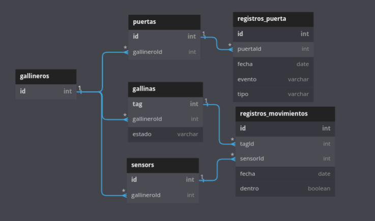
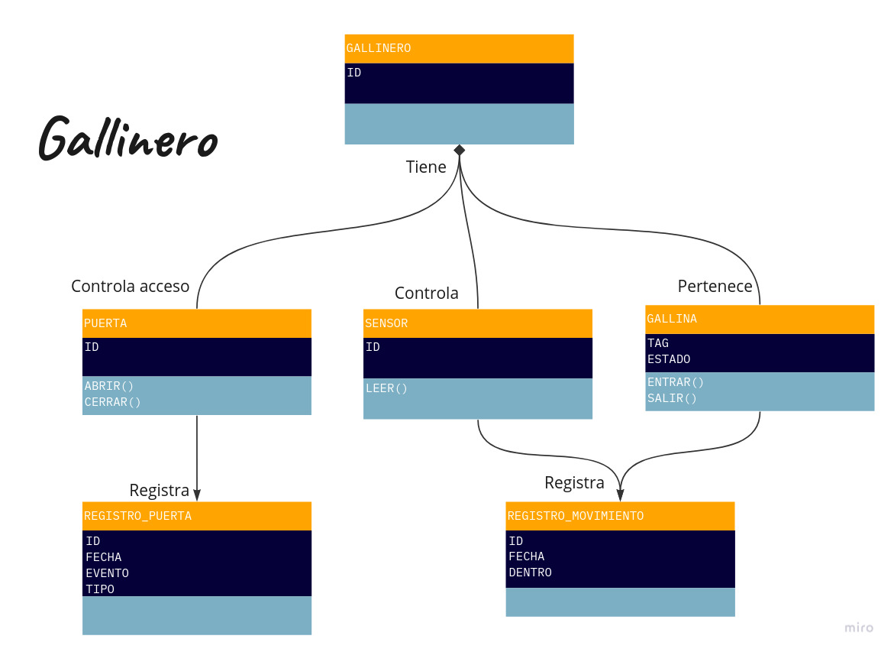

# AUTOMATIZACION GALLINERO EN CASA

Tenemos un gallinero, el cuál tiene una puerta conectada a un motor, este motor esta conectado al intranet de la casa. El motor puede o abrir la puerta o cerrar la puerta. Es todo lo que es capaz de hacer. Nuestro motor conectado enviará mensajes a un servicio de nuestro servidor cada vez que se abra o se cierre manualmente la puerta. Además, el servidor le enviará la orden de abrirse o cerrarse siguiendo las reglas que se han establecido en los requerimientos

## DESIGN

### DB

### DIAGRAM

### REQUIREMENTS AND FUNCTIONALITIES

[`README-requirements`](./Doc/Requerimientos.md)
